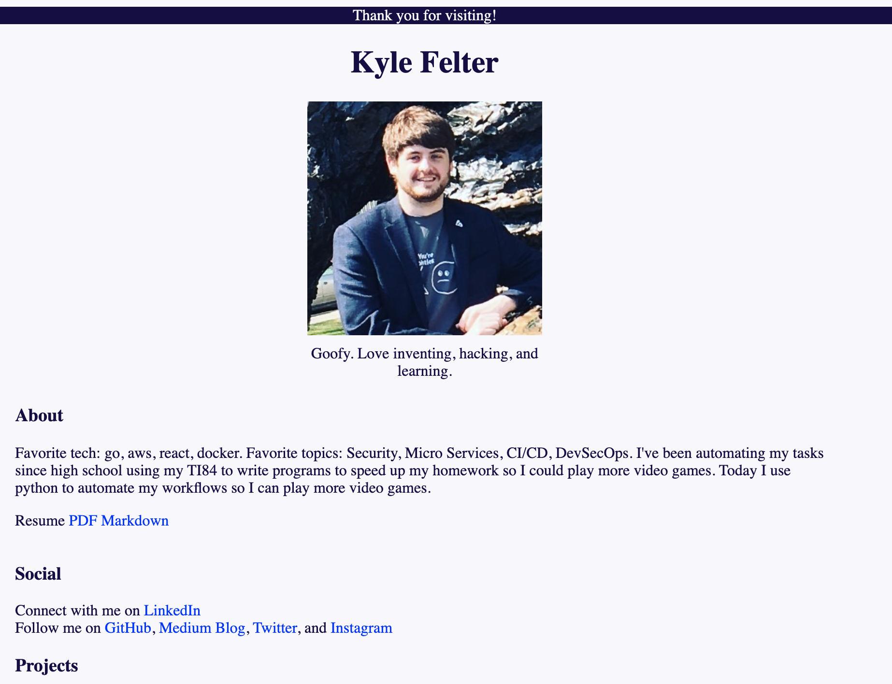

# Simple go file server

- Used to serve my html protfolio from an ec2
- The backend calls ipstack's api with your ip address and finds the callers city and state
- Used as a resource server for my blog
